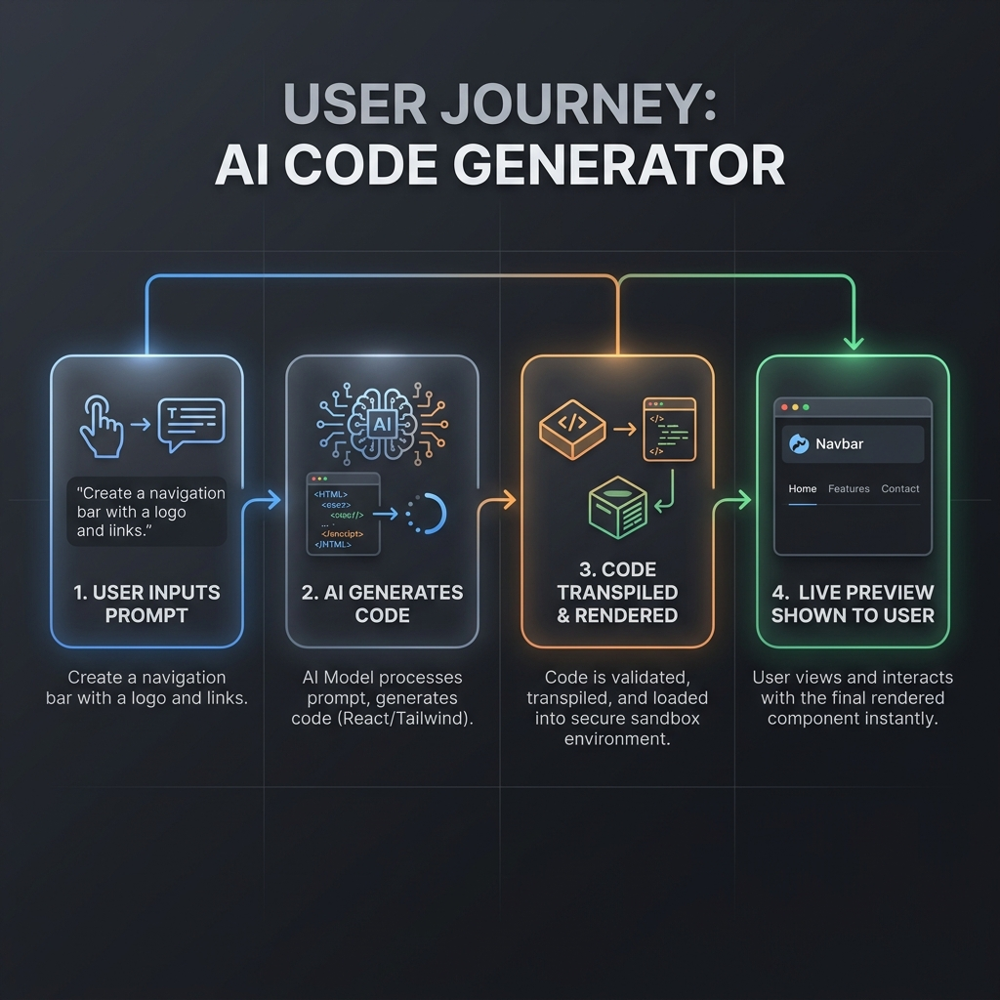

# AI Code Generator Frontend

> **Project Overview**: The AI Code Generator is a full-stack application that acts as an AI pair programmer. It allows users to write natural language prompts to instantly generate, preview, and edit UI components (like React/Tailwind) in real-time. This document describes the frontend client application.

## What is it?
This is the frontend client for the **AI Code Generator (Codegen)**. It is a stunning, interactive web application that acts as your personal AI pair programmer for UI development.

## What does it do?
It allows you to describe UI components in plain English (e.g., "Create a sleek login form using Tailwind") and instantly generates the working React code for it. It then renders a **live preview** of that component right in your browser, enabling you to iterate on your designs in real-time without leaving the app.

### Key Features
- **Tech Stack Selection:** Customize your generation output by selecting your preferred framework (e.g., React, Vue, HTML) and styling tools (e.g., Tailwind, CSS) directly from the interface.
- **Manual Code Editing:** The app features a robust built-in code editor, allowing you to manually refine and tweak the AI-generated code to perfection.
- **Live Preview Tabs:** Seamlessly switch between the code editor and the live preview tab, or view them side-by-side, to see your component running in real-time.
- **Light / Dark Mode:** Easily toggle between light and dark themes to test how your generated UI components adapt to different color schemes.

## How does it do it?
1. **Prompting:** You enter a natural language prompt in the UI.
2. **Streaming:** The frontend sends this request to our backend API, which streams back the AI-generated raw code piece by piece.
3. **In-Browser Transpilation:** As the code streams in, it is transpiled on-the-fly using Babel directly in your browser.
4. **Sandboxed Preview:** The transpiled code is injected into a secure, isolated `iframe` where it is rendered instantly for you to see.

---

## User Interface

The UI is built with a modern, glassmorphic design focusing on user experience.
## Dashboard:


## Editor screen


## Editor and live preview:


## Expanded view


## Application Flow

The user journey is streamlined to provide immediate visual feedback.




### Steps
1. **Prompt Input**: The user enters a natural language description of the desired UI component.
2. **AI Code Generation**: The request is sent to the backend where the AI streams the generated React/Tailwind code back to the client.
3. **Transpilation & Sandboxing**: The generated code is transpiled using Babel directly in the browser and executed within a secure, isolated iframe.
4. **Live Preview**: The resulting component is rendered instantly in the preview panel, allowing the user to iterate on the design.

## Tech Stack
- **Framework**: React with Vite
- **Styling**: Tailwind CSS
- **State Management**: Zustand
- **Routing**: TanStack Router
- **Icons**: Lucide React

---

## Setup Instructions

1. **Install Dependencies**:
   ```bash
   npm install
   ```

2. **Environment Variables**:
   Copy `.env.example` to `.env` and fill in any required variables.
   
3. **Run Development Server**:
   ```bash
   npm run dev
   ```
   The frontend application will be available at `http://localhost:5173`.
